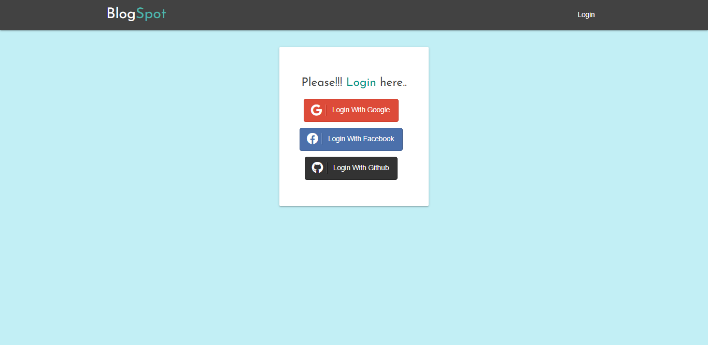
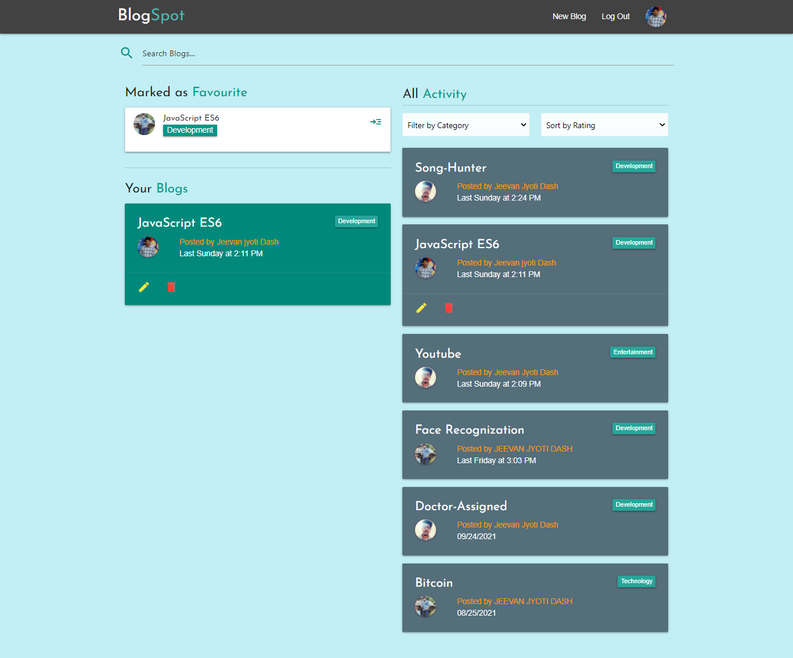
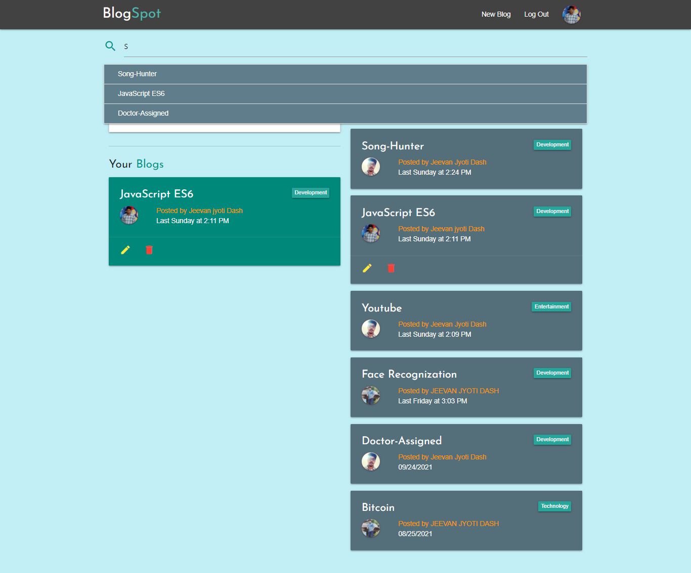
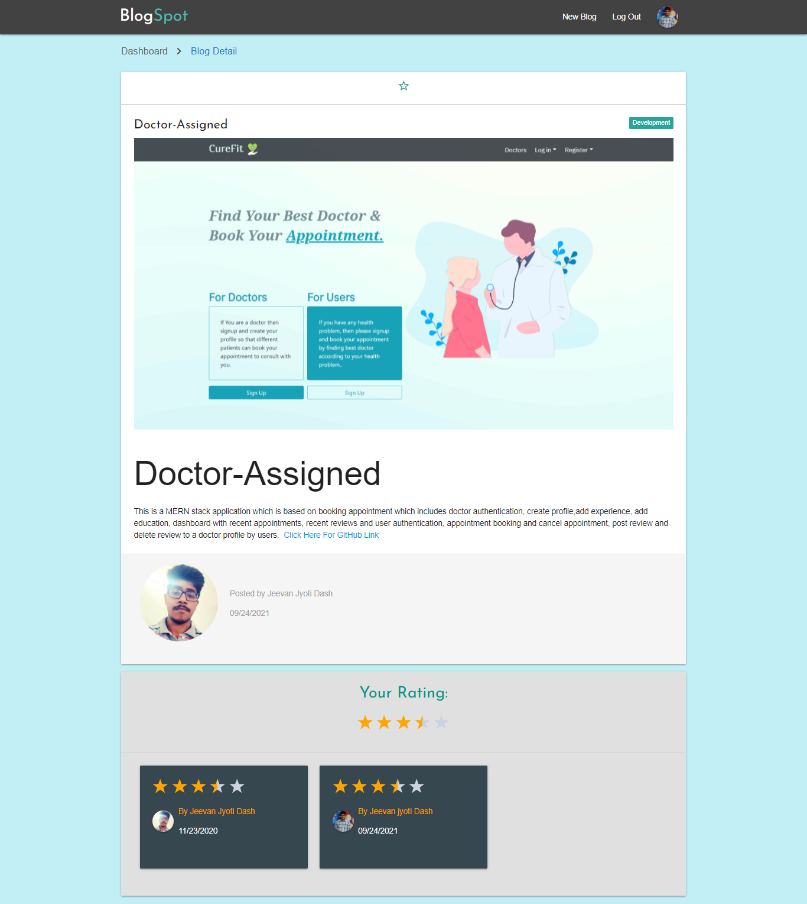
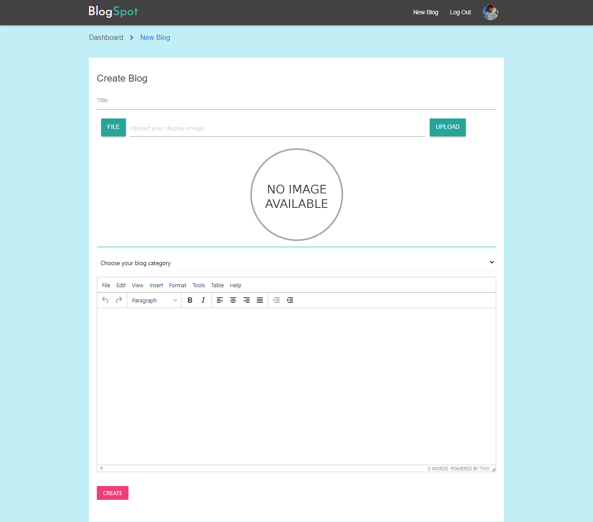

## BlogSpot

> React `Server side rending architecture` based `Blogging platform`.

#### Idea:

- User can `mark favorite` any blog and also give `rating` to any blog.
- Users can search blog.
- Users can filter blogs by `avg rating` and `blog category`.
- Users can join by choosing any social media provider authentication process.
- User can write blogs by giving `an title`, `a cover image` and with a `blog category`, the `real content`.
- For preventing from `XSS` internally using of `serialize-javascript` package with the help of `Server-side rendering` rules.

#### Tech Stack

- Client side:

  - React
  - Redux
  - Firebase(Cloud Firestore, Cloud Firestorage, Authentication)
  - webpack

- Server-side:
  - Express
  - Node.js

#### Screenshots

- 
- 
- 
- 
- 

#### Development

> Note: Make sure you have node.js and npm have installed properly.

- First, install all the required modules.
  - ```
    npm i or yarn
    ```
- Second, for demo purpose I have added all the firebase config inside `src/config/fbConfig.js`.
- Third, run the command and go to [http://localhost:3000](http://localhost:3000)
  - ```
    npm run dev or yarn dev
    ```
